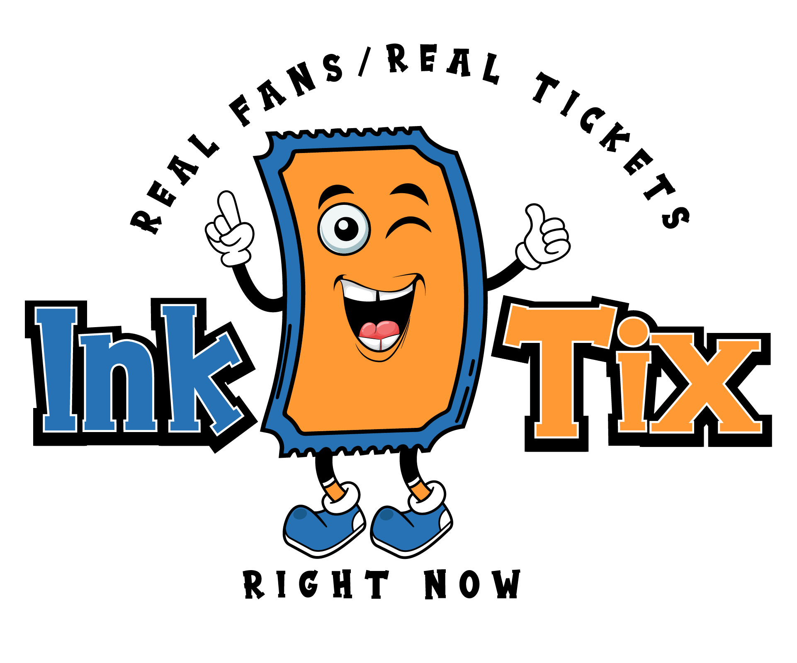

# InkTix: Cross-Chain Ticket Marketplace Network

<p align="center">
  
</p>


> A decentralized, cross-chain ticketing marketplace built with ink! smart contracts on Polkadot.

---

## Overview

**InkTix** is a cross-chain ticket marketplace that connects event brokers across multiple Polkadot parachains. Built with Rust and ink!, the system enables seamless ticket discovery, fraud-resistant NFT ticket trading, and cross-chain ownership using XCM.

---

## Documentation

- [Product Specification](./docs/product_specification.md)
- [System Architecture](./docs/system_architecture.md)
- [Changelog](./CHANGELOG.md)

---

## Project Structure

```bash
InkTix/
├── README.md                 # Main documentation
├── CHANGELOG.md              # Version history
├── docs/                     # Supporting documentation
│   ├── product_specification.md
│   └── system_architecture.md
├── contracts/                # ink! smart contracts
├── tests/                    # Cross-contract integration tests
├── scripts/                  # Build and deploy scripts
├── examples/                 # Example clients or usage
└── .gitignore
```

## Current Development Status 2025-08-13

### WORKING CONTRACTS

- **concert_broker v0.3.0**: Basic template, builds successfully
- **sports_broker v0.2.0**: Basic template, builds successfully
- **inktix_core v0.1.0**: Foundation template

### BUILD COMMANDS

```bash
cd contracts/concert_broker && cargo contract build
cd contracts/sports_broker && cargo contract build
```
